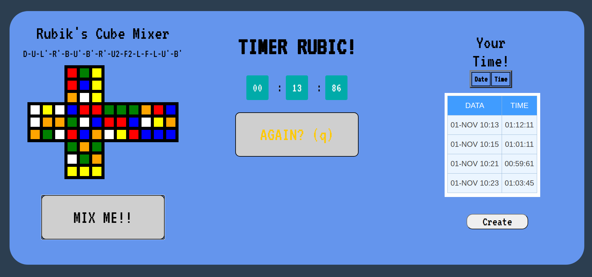

# rubikTimer
App (Django + React)

> Timer when you resolve Rubik Cube

> Click button - send your time to backend

This project was bootstrapped with [Create React App](https://github.com/facebook/create-react-app).

## How to run the project?

Clone repository, then go to `rubikTimer/fronted` directory and run

`npm install`

and after it

`npm start`

Runs the app in the development mode. 
Open [http://localhost:3000](http://localhost:3000) to view it in the browser.

The page will reload if you make edits. 
You will also see any lint errors in the console.

## How to run backend ?

Go to `rubikTimer/backend` directory

Activate the virtualenv for your project.

$ pip3 install django
Install project dependencies:

$ pip install -r requirements
Then simply apply the migrations:

$ python manage.py migrate
You can now run the development server:

$ python manage.py runserver
